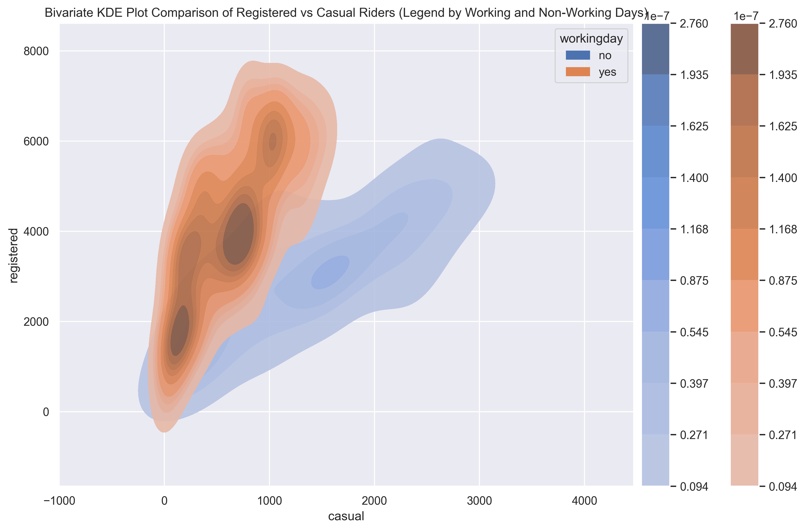
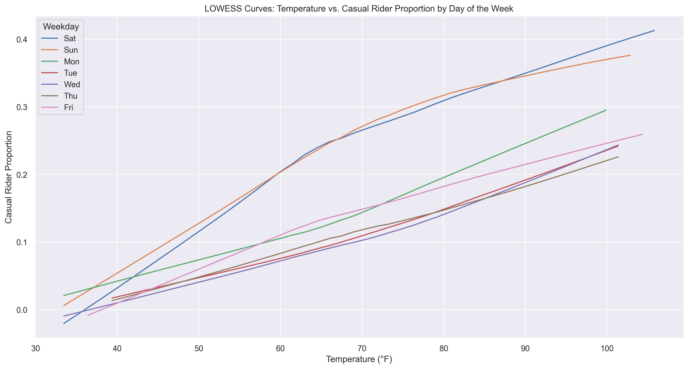

# 🚲 Bikeshare Usage Analysis – Washington D.C.

This project explores usage patterns in Washington D.C.’s bike-sharing system using hourly and daily data from 2011–2012. The goal is to understand behavioral trends across different rider types (casual vs. registered), identify temporal and weather-based patterns, and reflect on the limitations of the dataset from an equity standpoint.

---

## 📊 Project Summary

- **User Behavior:**  
  Registered users tend to ride during weekday commuting hours, while casual users prefer weekends and warmer days.

- **Temporal Trends:**  
  Hourly usage shows clear rush-hour peaks for registered users. Kernel density estimates visualize different riding habits across working and non-working days.

- **Temperature Impact:**  
  LOWESS-smoothed plots show a strong positive relationship between temperature and ridership, especially for casual users.

- **Equity Considerations:**  
  The dataset lacks demographic or geographic identifiers, limiting insight into equity. Proposed improvements include collecting user age, gender, income, and neighborhood.

- **Expansion Proposal:**  
  Cities with warm climates and existing transit infrastructure—such as San Francisco, Atlanta, and Los Angeles—are recommended for system expansion.

---

## 🧰 Tools & Technologies

- Python
- Jupyter Notebook
- Pandas, Seaborn, Matplotlib
- Statsmodels (LOWESS smoothing)
- Markdown

---

## 📁 Files Included

- `bikeshare-analysis.ipynb` – Full exploratory notebook
- `.png` visualizations – Plots used throughout the analysis
- `bikeshare.txt` – Dataset metadata
- `ds100_utils.py` – Utility functions used in the notebook

---

## 🖼️ Sample Visuals


*Bivariate KDE Plot Comparison of Registered vs Casual Riders (Legend by Working and Non-Working Days)*


*LOWESS Curves: Temperature vs. Casual Rider Proportion by Day of the Week*

---

## 🚀 Run It Yourself

### Option 1: Locally
```bash
pip install notebook pandas seaborn matplotlib statsmodels
jupyter notebook bikeshare-analysis.ipynb
```

### Option 2: In the Cloud
[](https://colab.research.google.com/)

---

## ✍️ Author

**Jade Chen**  
[LinkedIn](https://www.linkedin.com/in/jad3ch3n) | [GitHub](https://github.com/jad3ch3n)
